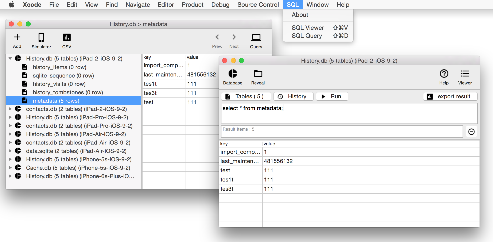
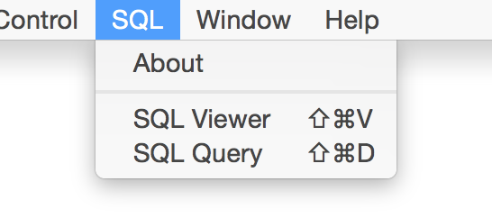
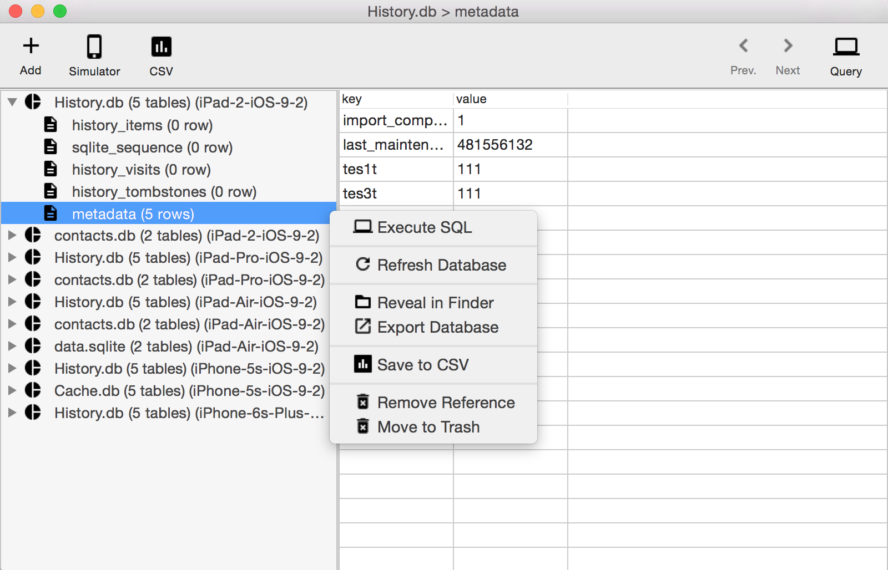
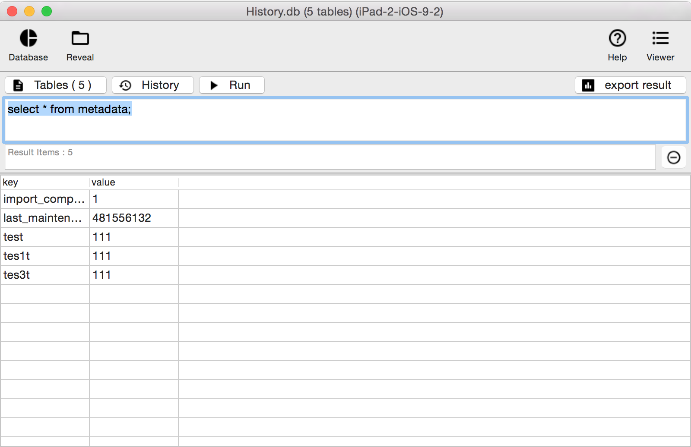

# SQLPlugin

[](https://travis-ci.org/viktyz/SQLPlugin)
[](http://opensource.org/licenses/MIT)
[](https://github.com/igrigorik/ga-beacon)

SQLPlugin is a plugin for Xcode. This plugin contains two tools for SQL operation. **SQL Viewer** and **SQL Query**.

**SQL Viewer** helps to list all files with database type in your simulator. And **SQL Query** helps to operate your database file.



With SQLPlugin you can easily to operate all kinds of database file ( sqlite \ db \ sql ) in your simulator or other directory.

## Features

<ul>
<li>[x] Database browser for SQL file ( sqlite \ db \ sql )</li>
<li>[x] Automatically load all databases in simulator directory</li>
<li>[x] Add / delete / export database</li>
<li>[x] SQL command support</li>
<li>[x] Export table as CSV file</li>
<li>[ ] Test coverage</li>
</ul>

## How to use

* After installed, You can see **SQL** Menu in your Xcode Window Menu.



* **SQL Viewer** helps to list all database files in your simulator. You can use `shift + command + V` to quick open it. All the files with database type in your simulator will list out automatically after **SQL Viewer** window loaded. You can also add any other file with database type by click `Add` button or just drag them into your plugin window.



* **SQL Query** helps to operate database file. You can use `shift + command + D` to quick open it. Then you can easily to query your SQL data by SQL commands. You can see the list of databases in your simulator by click `Database` button or `Database -> Refresh Database`. You can also add any other file with database type by click `Database -> Add New Database` or just drag them into your plugin window.



## Install

* Install through [Alcatraz](http://alcatraz.io/), the package manager for Xcode.
* Install through terminal, open up your terminal and paste this:
```bash
curl -fsSL https://raw.github.com/viktyz/SQLPlugin/master/Scripts/install.sh | sh
```
* Download the repository from Github and build it in Xcode. The plugin will be installed in 
```bash
~/Library/Application Support/Developer/Shared/Xcode/Plug-ins/SQLPlugin.xcplugin
```

You'll need to restart Xcode after the installation.

## Uninstall

* Open up your terminal and paste this:
```bash
rm -rf ~/Library/Application\ Support/Developer/Shared/Xcode/Plug-ins/SQLPlugin.xcplugin
```

The `SQL` Menu will disappear after restart Xcode.

## SQL Help

* [SQL Tutorial](http://www.tutorialspoint.com/sql/sql-select-query.htm) : SQL is a database computer language designed for the retrieval and management of data in relational database. SQL stands for Structured Query Language. This tutorial will give you quick start with SQL.
* [FMDB](https://github.com/ccgus/fmdb) : Most of the SQLPlugin functions are based on FMDB. You can read more about it from [here](http://ccgus.github.io/fmdb/).
* [SQLite.org](http://sqlite.org/) : SQLite is a software library that implements a [self-contained](http://sqlite.org/selfcontained.html), [serverless](http://sqlite.org/serverless.html), [zero-configuration](http://sqlite.org/zeroconf.html), [transactional](http://sqlite.org/transactional.html) SQL database engine. SQLite is the most widely deployed database engine in the world. The source code for SQLite is in the [public domain](http://sqlite.org/copyright.html).

## License
```
The MIT License (MIT)

Copyright (c) 2016 Alfred Jiang

Permission is hereby granted, free of charge, to any person obtaining a copy
of this software and associated documentation files (the "Software"), to deal
in the Software without restriction, including without limitation the rights
to use, copy, modify, merge, publish, distribute, sublicense, and/or sell
copies of the Software, and to permit persons to whom the Software is
furnished to do so, subject to the following conditions:

The above copyright notice and this permission notice shall be included in all
copies or substantial portions of the Software.

THE SOFTWARE IS PROVIDED "AS IS", WITHOUT WARRANTY OF ANY KIND, EXPRESS OR
IMPLIED, INCLUDING BUT NOT LIMITED TO THE WARRANTIES OF MERCHANTABILITY,
FITNESS FOR A PARTICULAR PURPOSE AND NONINFRINGEMENT. IN NO EVENT SHALL THE
AUTHORS OR COPYRIGHT HOLDERS BE LIABLE FOR ANY CLAIM, DAMAGES OR OTHER
LIABILITY, WHETHER IN AN ACTION OF CONTRACT, TORT OR OTHERWISE, ARISING FROM,
OUT OF OR IN CONNECTION WITH THE SOFTWARE OR THE USE OR OTHER DEALINGS IN THE
SOFTWARE.
```
